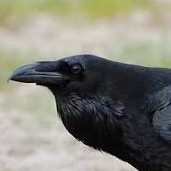

<div align="center">



# Corvus

A free and strong UCI chess engine.

  <br>
  <strong>[Explore Corvus docs »][wiki-link]</strong>
  <br>
  <br>
  [Report bug][issue-link]
  ·
  [Open a discussion][discussions-link]
  ·
  [Changelog][releases-link]

  [![License][license-badge]][license-link]
  [![Release][release-badge]][releases-link]
  <br>
  [![Commits][commits-badge]][commits-link]
  [![Stars][stars-badge]][stars-link]
  <br>
  [![Rust][rust-badge]][rust-link]
  [![UCI][uci-badge]][uci-link]

</div>

[wiki-link]: https://github.com/prabhutvasingh/corvus/wiki
[issue-link]: https://github.com/prabhutvasingh/corvus/issues
[discussions-link]: https://github.com/prabhutvasingh/corvus/discussions
[releases-link]: https://github.com/prabhutvasingh/corvus/releases
[license-badge]: https://img.shields.io/github/license/prabhutvasingh/corvus
[license-link]: https://github.com/prabhutvasingh/corvus/blob/main/LICENSE
[release-badge]: https://img.shields.io/github/v/release/prabhutvasingh/corvus
[commits-badge]: https://img.shields.io/github/commit-activity/m/prabhutvasingh/corvus
[commits-link]: https://github.com/prabhutvasingh/corvus/commits/main
[stars-badge]: https://img.shields.io/github/stars/prabhutvasingh/corvus
[stars-link]: https://github.com/prabhutvasingh/corvus
[rust-badge]: https://img.shields.io/badge/Rust-1.85-orange
[rust-link]: https://www.rust-lang.org/
[uci-badge]: https://img.shields.io/badge/UCI-compliant-blue
[uci-link]: https://backscattering.de/chess/uci/

---

## ✨ Features

### Move generation
- **Bitboard representation** — 64-bit boards, precomputed attack tables built at compile time (`const fn`)
- **Fully legal move generation** — the `make`/`unmake` + check-filter pattern, so it can never play a pseudo-legal move
- **Verified with perft** against the canonical standard test suites (see below)

### Search
| Component | Detail |
| --- | --- |
| Iterative deepenging | Searches depth 1, 2, 3, ... toward the limit, always ready to return the best move found so far |
| Alpha-beta + PVS | Principal-variation search with a null-window for 2nd+ moves |
| Quiescence search | Extends captures and promotions in calm positions, with **delta pruning** against hopeless captures (~100× node savings) |
| Transposition table | 1M-entry zobrist-hashed table storing bound/exact results, probed with move-preferred ordering |
| Move ordering | TT move, MVV-LVA captures, killer moves, history heuristics |
| Null-move pruning | R=2 with a material guard, never applied when in check or in zugzwang-prone positions |
| Late Move Reductions | Reduces quiet moves late in the move list with fractional margins |
| Check extensions | One extra ply when the side to move is in check |
| Mate distance pruning | Mates scored relative to the current node so the engine picks the fastest mate |
| Draw detection | 50-move rule and threefold repetition (correctly ignoring the current node's own key) |

### Evaluation
- Material + **piece-square tables**, symmetric for both colors
- **Mobility** (rook / bishop / queen reachable squares)
- **Bishop-pair bonus** and **passed-pawn bonus**
- **Tempo bonus** for the side to move

## 🚀 Quick start

Build the engine:

```bash
cargo build --release
```

The binary will be at `target/release/chess-engine`.

### Play against it

Point any UCI GUI at the binary:

```bash
target/release/chess-engine
```

It works out of the box with **GNOME Chess** (`gnome-chess`), which registers the engine
from `~/.config/gnome-chess/engines.conf`:

```ini
[Corvus]
protocol=uci
binary=/home/youruser/.local/bin/corvus
uci-go-option-easy-0=depth 2
uci-go-option-normal-0=depth 6
uci-go-option-hard-0=depth 10
```

Or drive it directly from a terminal:

```
position startpos moves e2e4 e7e5
go depth 6
info depth 6 score cp 12 ... pv g1f3 b8c6 b1c3 ...
bestmove g1f3
```

## 🧰 Tooling commands

The engine doubles as a small analysis tool. When not in a UCI GUI you can use these:

| Command | What it does |
| --- | --- |
| `chess-engine` | Starts UCI mode |
| `chess-engine perft [depth]` | Perft from the starting position (default depth 5) |
| `chess-engine divide [depth]` | Perft from the starting position, split per first move |
| `chess-engine perftfen <fen> <depth>` | Perft from an arbitrary position |

Inside UCI mode the non-standard commands `d` (board dump + FEN), `eval` (static
evaluation), and `perft` are also available as debugging aids.

## ✅ Perft verification

Perft counts every legal move to a fixed depth and is the gold standard for verifying a
move generator. Corvus matches the canonical results:

| Position | Depth | Nodes | Result |
| --- | --- | --- | --- |
| Start position | 6 | 119,060,324 | ✅ |
| Kiwipete | 5 | 193,690,690 | ✅ |
| Position 3 | 6 | 11,030,083 | ✅ |
| Position 4 | 5 | 15,833,292 | ✅ |
| Position 5 | 5 | 89,941,194 | ✅ |
| Position 6 | 5 | 164,075,551 | ✅ |

## 🧪 Tests

```bash
cargo test --release --lib
```

The suite includes the full perft suite, plus regression tests for the trickier parts of
the rules — en-passant capture legality, pawn captures that *should* be generated (don't
ask how that one got in here), and more.

## ⚡ Performance

Measured on a release build (`opt-level = 3`, `lto`, `codegen-units = 1`, `panic = abort`):

- **Move generation (perft):** ~11M nodes/sec
- **Search, middlegame:** ~500k nodes/sec
- **Search, endgame:** ~1.5M nodes/sec

## 📁 Project layout

```
src/
├── bitboard.rs   # attack tables (const fn), slider rays
├── board.rs      # position, make/unmake, FEN, Zobrist hashing
├── movegen.rs    # legal move generation
├── perft.rs      # perft + divide
├── eval.rs       # symmetric evaluation
├── search.rs     # iterative deepening, alpha-beta/PVS, quiescence, TT
├── uci.rs        # UCI protocol loop
└── main.rs       # CLI entry point
```

## 📜 License

GPL-3.0-or-later. See [LICENSE](LICENSE).

---

<div align="center">

Made with 🦀 and an unreasonable amount of `bit(idx - 1)`.

</div>